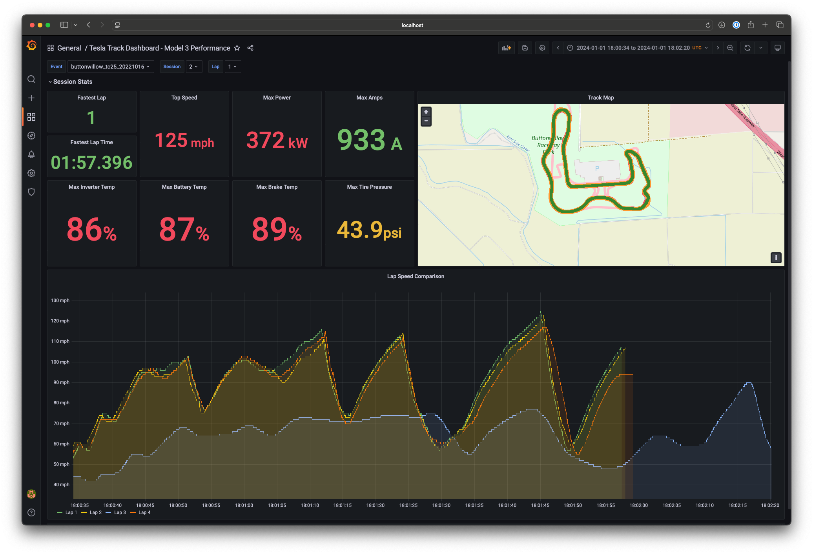
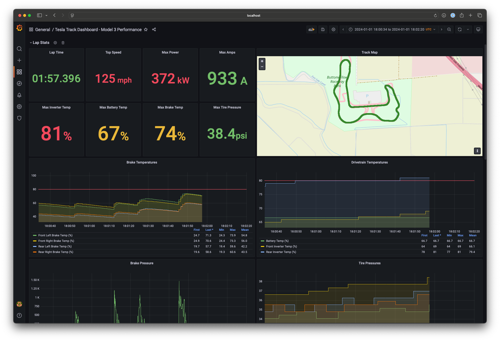
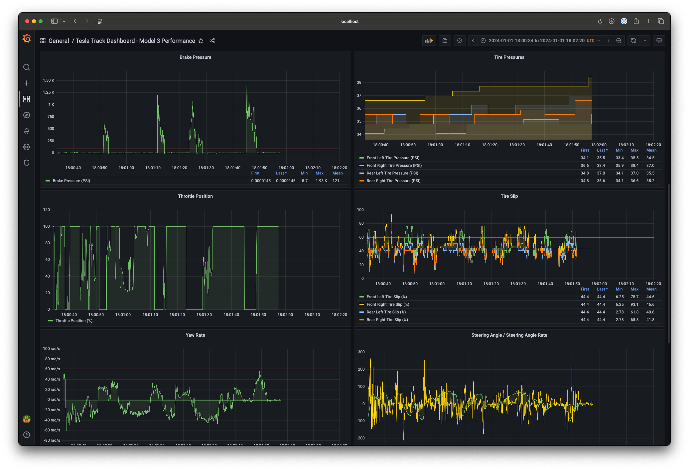
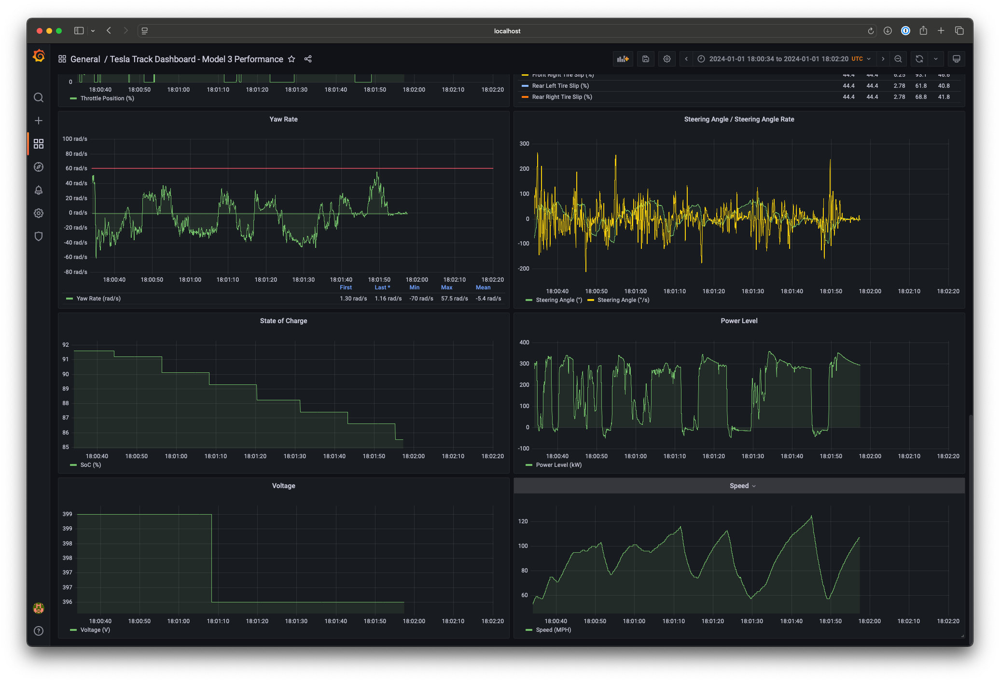
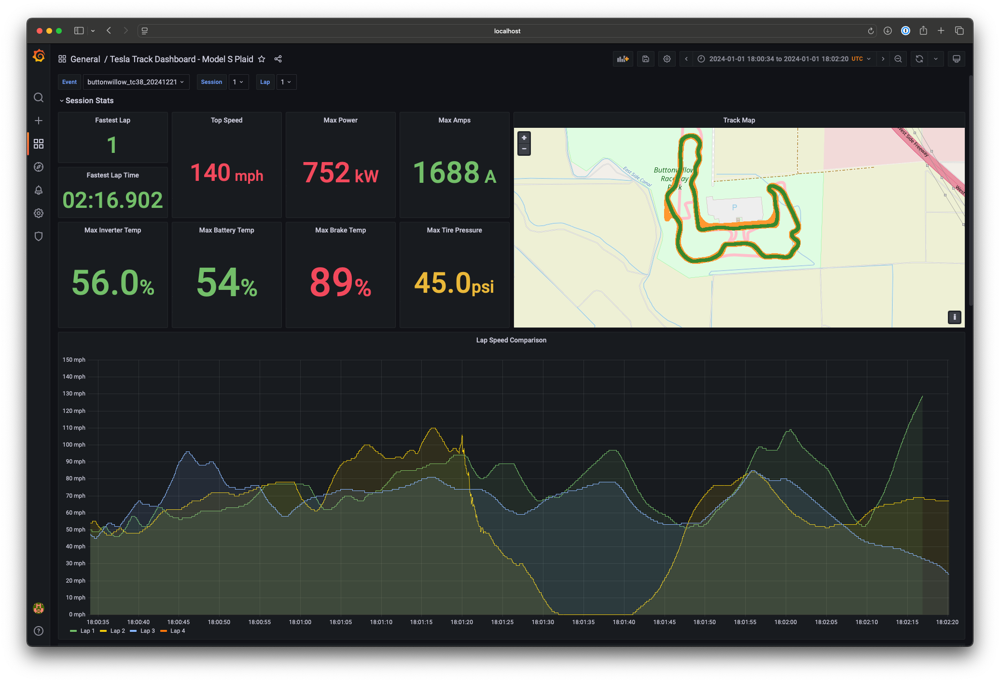
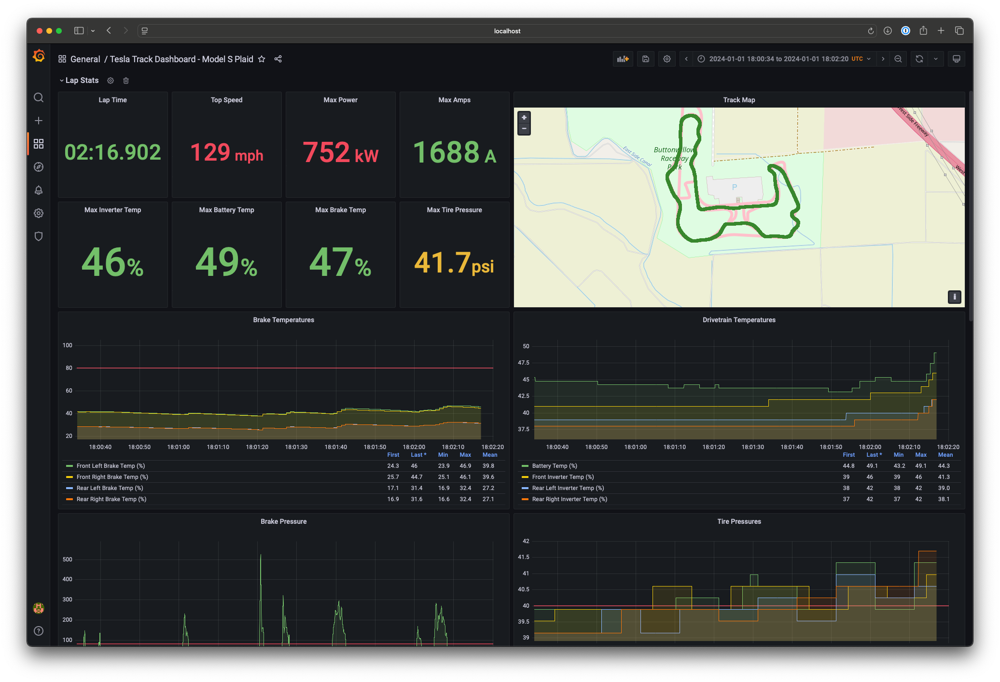
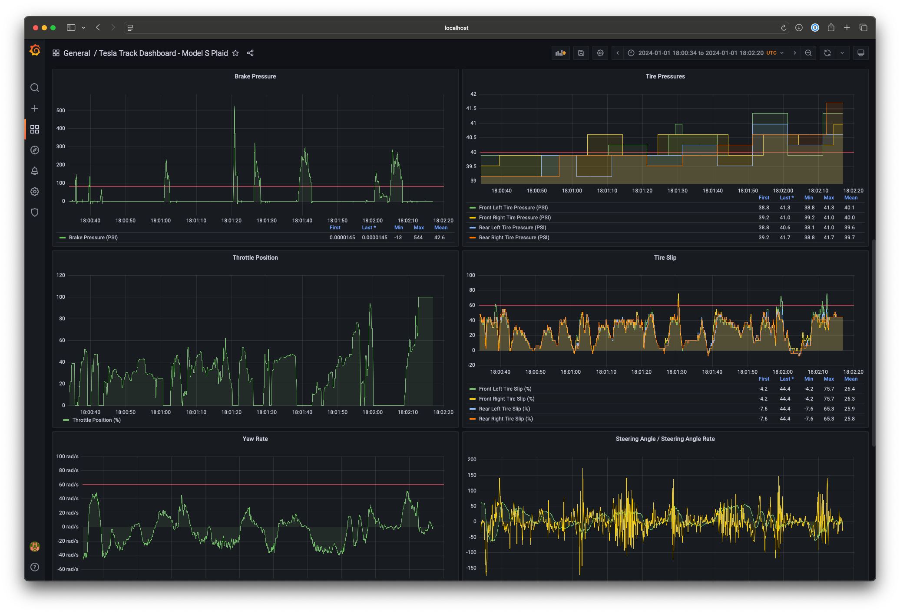
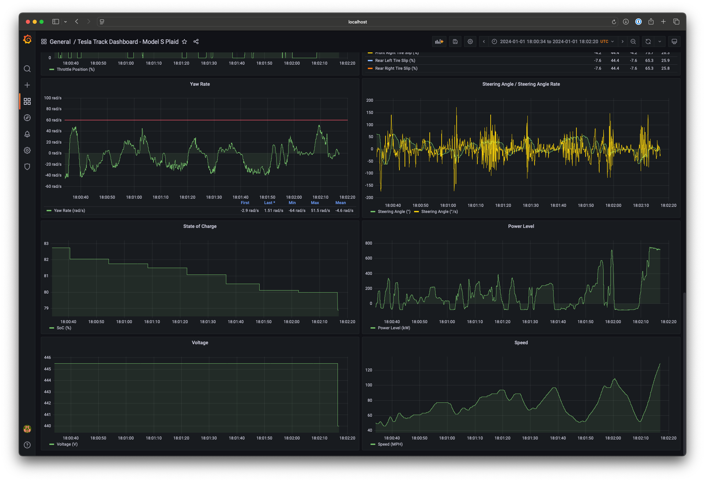

README
=========

### Introduction

I built a simple data pipeline along with a few Grafana dashboards to better visualize the data collected by Tesla Track Mode. Below I have included a step by step guide that explains everything needed to get you started.

* Model 3 Performance Dashboard
  * Model 3 Performance - Session View
    * 
  * Model 3 Performance - Lap View 1 of 3
    * 
  * Model 3 Performance - Lap View 2 of 3
    * 
  * Model 3 Performance - Lap View 3 of 3
    * 

* Model S Plaid Dashboard
  * Model S Plaid - Session View
    * 
  * Model S Plaid - Lap View 1 of 3
    * 
  * Model S Plaid - Lap View 2 of 3
    * 
  * Model S Plaid - Lap View 3 of 3
    * 

### Setup

* Prerequisites
  * Docker for Desktop or similar container engine installed on your workstaion or server
  * Directory that will house the persistent PostgreSQL data
    ```bash
    mkdir -pv /Users/<Username>/Containers/postgresql/var/lib/postgresql/data
    ```
* Initial Setup
  * With Docker for Desktop (or equivalent) installed and running, we will first start by opening a command line window
  * Create the docker network
    ```bash
    docker network create grafana
    ```
  * Create the PostgreSQL container
    ```bash
    docker run -d --name postgresql -e POSTGRES_USER=postgres -e POSTGRES_PASSWORD=Password123 -v /Users/Username/Containers/postgresql/var/lib/postgresql/data:/var/lib/postgresql/data -p 5432:5432 --network=grafana --restart=always -t postgres:latest
    ```
  * Create the tesla_track_db PostgreSQL database
    ```bash
    docker exec -i postgresql psql -U postgres <<EOSQL
    CREATE DATABASE tesla_track_db;
    EOSQL
    ```
  * Create the Grafana container
    ``` bash
    docker run -d --name=grafana --restart=always -p 3000:3000 --network=grafana --restart=always -t grafana/grafana:latest
    ```
  * Grafana Initialization
    * Login to Grafana
    * Create the PostgreSQL datasource using the following settings:
      * Name: PostgreSQL
      * Host: postgresql:5432
      * User: postgres
      * Password: <Enter the appropriate password here>
      * TLS/SSL Mode: disable
    * Import the dashboards
* Track Mode Data Importer
  * Install the required Python modules
    ```bash
    pip install pandas
    pip install psycopg2-binary
    ```
  * Copy your track mode CSV data from the car to any given folder on your workstation or server
  * Browse to said folder
  * Rename the files like so:
    * 1.csv
    * 2.csv
    * 3.csv
    * 4.csv
  * Run the importer script
    * Usage Example
      ```bash
      python script.py <PGSQL_Hostname> <PGSQL_Username> <PGSQL_Password> <track_name>_<track_event>_<YYYYMMDD> <motor_count>
      ```
    * Model 3 Performance Example
      ```bash
      python tesla_track_mode_data_importer.py localhost postgres Password123 buttonwillow_tc25_20221016 2
      ```
    * Model S Plaid Example
      ```bash
      python tesla_track_mode_data_importer.py localhost postgres Password123 buttonwillow_tc38_20241221 3
      ```
* Analyze your track data using the dashboards, make sure to pick the appropriate Event, Session, Lap, etc from the drop downs at the top of the Grafana interface
  
### FAQs

* Why is the time range always set to "2024-01-01 18:00:34 to 2024-01-01 18:02:20"?
  * This is done on purprose and allows Grafana to overlay lap data without having to change the time series values.
* What should I do if the Track Mode Data Importer fails?
  * You can drop the appropriate event table from the PostgreSQL database using the following commands:
    ```bash
    docker exec -i postgresql psql -U postgres -d tesla_track_db <<EOSQL
    DROP TABLE <Enter the approrpiate event name here>;
    EOSQL
    ```
  * You can then re-run the Track Mode Data Importer script again.
